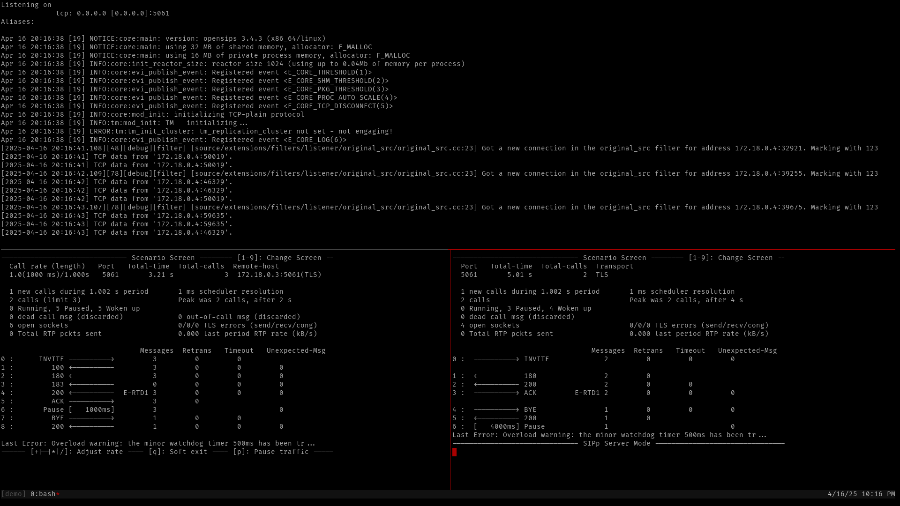

# OpenSIPS Summit 2025, TLS via Envoy PoC

## Traffic

```
                                              Box                                              
             ______________________________________________________________________            
            /                                                                      \           
           /                                                                        \          
 UAC       .    iptables           Envoy                       OpenSIPS             .       UAS
  |                |                 |                             |                         | 
  |-TLS (5061)---->|                 |                             |                .        | 
  |        .       |-SO_MARK: 123-.  |                             |                         | 
  |                |              |  |                             |                .        | 
  |        .       |<-------------`  |                             |                         | 
  |                |                 |                             |                .        | 
  |        .       |-TLS (11111)---->|                             |                         | 
  |                |                 |-TCP (5061, orig. src.)----->|                .        | 
  |        .       |                 |            ^^^^^^^^^^       |-SO_MARK: 42-.           | 
  |                |                 |   [from SO_MARK: 123]       |             |  .        | 
  |        .       |                 |                             |<------------`           | 
  |                |<------------------TCP to UAS addr. (any dst.)-|                .        | 
  |        .       |                 | ^^^^^^^^^^^^^^^^^^^^^^^^^^^ |                         | 
  |                |                 |    [catched by SO_MARK: 42] |                .        | 
  |        .       |-TCP (22222)---->|                             |                         | 
  |                |                 |-TLS (orig. dst.)------------------------------------->| 
  |        .       |                 |                             |                .        | 
  |                |                 |                             |                         | 
  |        .       |                 |                             |                .        | 
           \                                                                        /          
            \______________________________________________________________________/           

```

## Usage
`./run.sh`

## Dependency
- Docker

## Screenshot

